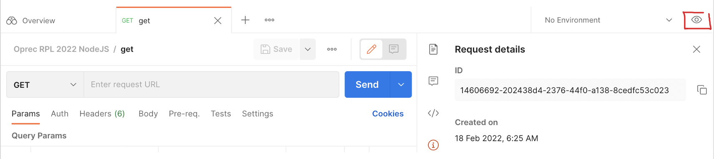

# Pertemuan 3

# Table of Contents

- [Pertemuan 3](#pertemuan-3)
- [Table of Contents](#table-of-contents)
- [Membuat Task Manager API](#membuat-task-manager-api)
  - [Connect to Database](#connect-to-database)
    - [MongoDB](#mongodb)
    - [Mongoose](#mongoose)
    - [Model](#model)
    - [Validation](#validation)
    - [Try Catch Block](#try-catch-block)
    - [CRUD](#crud)
    - [Put vs Patch](#put-vs-patch)
    - [Responses Type](#responses-type)
- [Referensi](#referensi)

# Membuat Task Manager API

Pada pertemuan kali ini kita akan praktek menggunakan Express, kita akan membuat API yang digunakan untuk aplikasi Task Manager.

Untuk route yang akan dibuat:

- GET api/tasks (get all tasks)
- POST api/tasks (create task)
- GET api/tasks/:id (get task)
- PUT/PATCH api/tasks/:id (update task)
- DELETE api/tasks/:id

Kita akan menggunakan Postman untuk mengetes API kita. Kamu bisa menggunakan environment variabel untuk mempermudah. Klik mata di pojok kanan atas.



Tambahkan variabel.


Kemudian bisa kamu tambahkan seperti ini.


Untuk praktek membuat Task Manager API ini, akan digunakan beberapa library:

1. dependencies
   1. dotenv
   2. express
   3. mongoose
2. devDependencies
   1. nodemon

## Connect to Database

### MongoDB

MongoDB adalah salah satu jenis database NoSQL yang cukup populer digunakan dalam pengembangan website. Berbeda dengan database jenis SQL yang menyimpan data menggunakan relasi tabel, MongoDB menggunakan dokumen dengan format JSON. Hal inilah yang dianggap membuat pengelolaan data menggunakan MongoDB lebih baik. Alhasil, banyak perusahaan besar seperti Adobe, Google dan ebay yang menggunakannya.

Jika dalam database mySQL 1 jumlah entitas disebut row, maka pada MongoDB disebut document. Nama properti pada 1 dokumen dengan dokumen lainnya tidak harus sama pada MongoDB (properti pada mySQL adalah kolom tabel).

Di sini kita akan menggunakan cloud database service MongoDB Atlas, kamu dapat mengikuti panduan link di bawah atau mengikuti tutorial ini.

[Get Started with Atlas — MongoDB Atlas](https://docs.atlas.mongodb.com/getting-started/)

1. Pada website Mongodb [MongoDB: The Application Data Platform | MongoDB](https://www.mongodb.com/), buat akun dan login.

   

2. Pilih layanan yang free.

   

3. Kemudian ada pilihan opsi, isi nama **Cluster Name**, kemudian create cluster.

   

   

4. Buat username dan password untuk akses user jika ingin connect ke database nantinya.

   

   Pada section **Security > Network Access,** **Add IP Address** kemudian **Allow Access from Anywhere**, kemudian **Confirm.** Ini untuk mengatur IP Address mana saja yang dapat mengakses database.

   

5. **Browse Collections**, kemudian **Add My Own Data**.

   

   

   

   Nah di sini kita dapat menambahkan database. Collection analoginya sama dengan ‘table’ pada MySQL. Isi database = `Testing` dan collection = `tasks`, create.

6. Connect database.

   

   Kemudian pilih **connect your application**. Connection string ini akan dipakai di aplikasi kita nantinya.

   

### Mongoose

Sekarang kita akan coba connect aplikasi NodeJS ke database MongoDB kita yang sudah dibuat. Kita akan menggunakan package Mongoose, karena dengan package ini akan lebih mudah untuk berinteraksi dengan MongoDB (tidak dari scratch mengodingnya). Untuk menggunakan Mongoose, sangat disarankan untuk membaca dokumentasinya di [Mongoose v6.2.2: Schemas (mongoosejs.com)](https://mongoosejs.com/docs/guide.html).

Pertama, `npm install mongoose --save` jika belum menginstall package Mongoose.

Buat file **db/connect.js**

```jsx
const mongoose = require("mongoose");

const connectDB = (url) => {
  return mongoose.connect(url);
};

module.exports = connectDB;
```

Pada **app.js**

```jsx
const express = require("express");
const app = express();
const tasks = require("./routes/tasks");
require("dotenv").config();
const connectDB = require("./db/connect");

const port = process.env.PORT || 3000;

app.use(express.json());

app.use("/api/v1/tasks", tasks);

const start = async () => {
  try {
    await connectDB(process.env.MONGO_URI);
    app.listen(port, console.log(`server is listening on port ${port}...`));
  } catch (error) {
    console.log(error);
  }
};

start();
```

Buat file **.env.** File **.env** adalah dimana kamu bisa menyimpan variabel-variabel sensitif seperti secret key. **.env** harus kamu tambahkan di **.gitignore** agar tidak terpush ke github.

```bash
MONGO_URI=mongodb+srv://hasnarof:<password>@hasnacluster.zqyu2.mongodb.net/myFirstDatabase?retryWrites=true&w=majority
PORT=3000
```

MONGO_URI diisi connection string yang didapat dari MongoDB Atlas tadi. `<password>` diisi password user yang dapat mengakses database. `myFirstDatabase` diisi nama database yang telah dibuat.

Disini kita menggunakan package **dotenv** agar kita dapat mengakses file **.env** pada **app.js.** Contoh variabel **.env** diakses dengan `process.env.MONGO_URI`.

### Model

Buat **models/Task.js.** Di sini kita akan membuat schema untuk model Task (table bernama Task).

```jsx
const mongoose = require("mongoose");

const TaskSchema = new mongoose.Schema({
  name: String,
  completed: Boolean,
});

module.exports = mongoose.model("Task", TaskSchema);
```

Di sini kita membuat struktur properti untuk entitas Task. Jika nantinya ada request body dengan properti selain yang didefinisikan di sini, maka tidak dapat masuk. Hal ini mempermudah kita dalam menggunakan MongoDB, karena MongoDB sendiri tidak memiliki validation agar properti yang dimiliki dokumen-dokumen dalam 1 collection sama.

Kemudian, buat **routes/tasks.js**

```jsx
const express = require("express");
const router = express.Router();

const {
  getAllTasks,
  createTask,
  getTask,
  updateTask,
  deleteTask,
} = require("../controllers/tasks");

router.route("/").get(getAllTasks).post(createTask);
router.route("/:id").get(getTask).patch(updateTask).delete(deleteTask);

module.exports = router;
```

**controllers/tasks.js**

```jsx
const Task = require("../models/Task");

const createTask = async (req, res) => {
  const task = await Task.create(req.body);
  res.status(201).send({ task });
};

const getAllTasks = (req, res) => {
  res.end("get all tasks");
};

const getTask = (req, res) => {
  res.end("get task");
};

const updateTask = (req, res) => {
  res.end("update task");
};

const deleteTask = (req, res) => {
  res.end("delete task");
};

module.exports = { createTask, getAllTasks, getTask, updateTask, deleteTask };
```

**app.js**

```jsx
const express = require("express");
const app = express();
const tasks = require("./routes/tasks");
require("dotenv").config();
const connectDB = require("./db/connect");

const port = process.env.PORT || 3000;

app.use("/api/v1/tasks", tasks);

const start = async () => {
  try {
    await connectDB(process.env.MONGO_URI);
    app.listen(port, console.log(`server is listening on port ${port}...`));
  } catch (error) {
    console.log(error);
  }
};

start();
```

Kemudian testing pada Postman.


### Validation

**model/Task.js**

```jsx
const mongoose = require("mongoose");

const TaskSchema = new mongoose.Schema({
  name: {
    type: String,
    required: [true, "must provide name"],
    trim: true,
    maxlength: [20, "name can not be more than 20 characters"],
  },
  completed: {
    type: Boolean,
    default: false,
  },
});

module.exports = mongoose.model("Task", TaskSchema);
```

Kita dapat memvalidasi input req.body untuk create task dengan cara di atas. Kita juda dapat memasukkan pesan error jika input tidak tervalidasi. Di atas adalah contoh sederhana, kamu dapat mengeksplor dokumentasi Mongoose lebih lanjut untuk yang lebih advance.

Jika kamu tidak memakai try catch, maka nodemon akan terinterupsi jika ada error validation. Maka, kita akan memakai try catch block.

### Try Catch Block

**controllers/tasks.js**. Pada fungsi **createTask**:

```jsx
const createTask = async (req, res) => {
  try {
    const task = await Task.create(req.body);
    res.status(201).json({ task });
  } catch (err) {
    res.status(500).json({ msg: err });
  }
};
```

Maka hasilnya akan seperti berikut:


### CRUD

Pada Mongoose, sudah tersedia helper function untuk CRUD Operations.


**controllers/tasks.js**

```jsx
const Task = require("../models/Task");

const createTask = async (req, res) => {
  try {
    const task = await Task.create(req.body);
    res.status(201).json({ task });
  } catch (error) {
    res.status(500).json({ msg: error });
  }
};

const getAllTasks = async (req, res) => {
  try {
    const tasks = await Task.find({}); // bisa menggunakan filter pada argumen fungsi find()
    res.status(200).json({ tasks });
  } catch (error) {
    res.status(500).json({ msg: error });
  }
};

const getTask = async (req, res) => {
  try {
    const { id: taskID } = req.params;
    const task = await Task.findOne({ _id: taskID });
    if (!task) {
      return res.status(404).json({ msg: `No task with id: ${taskID}` });
    }
    res.status(200).json({ task });
  } catch (error) {
    res.status(500).json({ msg: error }); // untuk handle jika id nya tidak valid
  }
};

const deleteTask = async (req, res) => {
  try {
    const { id: taskID } = req.params;
    const task = await Task.findOneAndDelete({ _id: taskID });
    if (!task) {
      return res.status(404).json({ msg: `No task with id: ${taskID}` });
    }
    res.status(200).json({ task: null, status: "success" });
  } catch (error) {
    res.status(500).json({ msg: error });
  }
};

const updateTask = async (req, res) => {
  try {
    const { id: taskID } = req.params;
    const task = await Task.findOneAndUpdate({ _id: taskID }, req.body, {
      new: true, // const task akan berisi task yang telah terupdate
      runValidators: true,
    });
    if (!task) {
      return res.status(404).json({ msg: `No task with id: ${taskID}` });
    }
    res.status(200).json({ task });
  } catch (error) {
    res.status(500).json({ msg: error });
  }
};

module.exports = { createTask, getAllTasks, getTask, updateTask, deleteTask };
```

### Put vs Patch

Perhatikan req.body dan hasil response nya di bawah ini.


Untuk put, akan meremove properti yang tidak diminta di req.body, berbeda dengan patch yang hanya mengupdate properti yang diminta di req.body. Behavior put dan patch seperti ini adalah expected bukan otomatis, oleh karena itu kita akan menghandle nya pada aplikasi Node kita. Untuk contoh di bawah, karena untuk metode patch kita sudah menggunakan fungsi **updateTask** pada controller, maka untuk metode put kita akan menggunakan fungsi **editTask**. Kita menambahkan `overwrite: true` untuk argumen fungsi **findOneAndUpdate** nya.

**controllers/tasks.js**

```jsx
const Task = require("../models/Task");

/* fungsi crud yang lain tersedia di atas */

/* metode patch */
const updateTask = async (req, res) => {
  try {
    const { id: taskID } = req.params;
    const task = await Task.findOneAndUpdate({ _id: taskID }, req.body, {
      new: true,
      runValidators: true,
    });
    if (!task) {
      return res.status(404).json({ msg: `No task with id: ${taskID}` });
    }
    res.status(200).json({ task });
  } catch (error) {
    res.status(500).json({ msg: error });
  }
};

/* metode put */
const editTask = async (req, res) => {
  try {
    const { id: taskID } = req.params;
    const task = await Task.findOneAndUpdate({ _id: taskID }, req.body, {
      new: true,
      runValidators: true,
      overwrite: true, // ini yang dibutuhkan untuk method put
    });
    if (!task) {
      return res.status(404).json({ msg: `No task with id: ${taskID}` });
    }
    res.status(200).json({ task });
  } catch (error) {
    res.status(500).json({ msg: error });
  }
};
```

**routes/tasks.js**

```jsx
const express = require("express");
const router = express.Router();

const {
  getAllTasks,
  createTask,
  getTask,
  updateTask,
  editTask,
  deleteTask,
} = require("../controllers/tasks");

router.route("/").get(getAllTasks).post(createTask);
router
  .route("/:id")
  .get(getTask)
  .patch(updateTask)
  .delete(deleteTask)
  .put(editTask);

module.exports = router;
```

**model/Task.js ,** untuk properti **completed** akan dapat dihilangkan

```jsx
const mongoose = require("mongoose");

const TaskSchema = new mongoose.Schema({
  name: {
    type: String,
    required: [true, "must provide name"],
    trim: true,
    maxlength: [20, "name can not be more than 20 characters"],
  },
  completed: {
    type: Boolean,
    // default: false
  },
});

module.exports = mongoose.model("Task", TaskSchema);
```

### Responses Type

Pada API umumnya, kamu dapat menemukan tipe response seperti ini.

```jsx
const getAllTasks = async (req, res) => {
  try {
    const tasks = await Task.find({}); // bisa menggunakan filter pada argumen fungsi find()
    res.status(201).json({
      success: true,
      data: {
        tasks,
        amount: tasks.length,
      },
    });
  } catch (error) {
    res.status(500).json({ msg: error });
  }
};
```

Tipe response ada beberapa macam tergantung preference developer team.

# Referensi

[Coding Addict - YouTube](https://www.youtube.com/channel/UCMZFwxv5l-XtKi693qMJptA)
